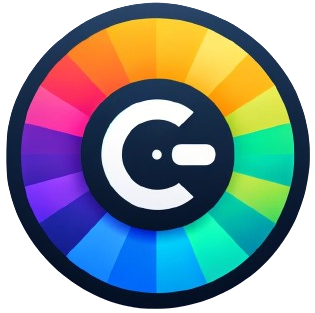
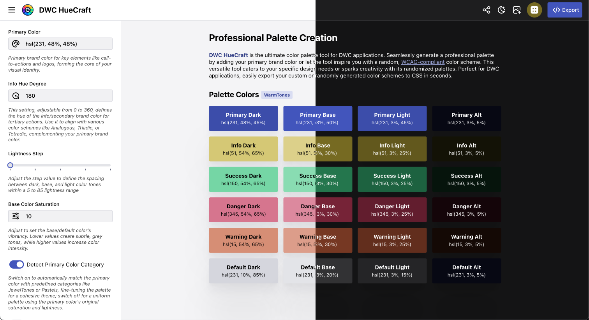

# 
 <a href="https://hyyan.github.io/huecraft/">DWC HueCraft</a>

  

**DWC HueCraft** is the ultimate color palette tool for DWC applications. Seamlessly generate a professional palette by adding your primary brand color, uploading your logo, or let the tool inspire you with a random, [WCAG-compliant](https://www.w3.org/WAI/WCAG21/Understanding/contrast-minimum.html) color scheme. This versatile tool caters to your specific design needs or sparks creativity with its randomized palettes. Perfect for DWC applications, easily export your custom or randomly generated color schemes to CSS in seconds.

## 🌈 Features

- 🎨 **Custom Palette Generation**: Input your primary brand color or upload your company logo to generate a cohesive and professional color palette tailored to your brand.
- 🖼️ **Logo-Based Palette Creation**: Utilize your logo to create a color scheme that complements your brand's visual identity.
- 🎲 **Random Palette Inspiration**: Get inspired with a randomly generated, WCAG-compliant color scheme, ideal for a variety of design applications.
- ✅ **WCAG Compliance**: Ensures all color schemes meet the Web Content Accessibility Guidelines (WCAG) for color contrast.
- 💻 **CSS Export**: Conveniently export your color schemes directly to CSS, making it easy to integrate with your DWC application.
- 🔗 **Link Sharing**: Share a link to your created color scheme, allowing others to view and use your custom palette.
- 🖱️ **User-Friendly Interface**: A simple and intuitive interface that makes color scheme generation a breeze.

## 🚀 Experimental Chrome Extension

  

Enhance your design workflow with DWC HueCraft's experimental Chrome extension:

- 🌐 **Real-Time Color Scheme Application**: Dynamically apply different color schemes to your DWC application and see changes in real time.
- 💾 **CSS Variable Export**: Easily export color schemes as CSS variables, streamlining the process of integrating the colors into your DWC applications.

### 🛠️ Testing the Chrome Extension

To test the `huecraft-cext.zip` extension in Chrome:

1. 📥 Download the `huecraft-cext.zip` file from the [repository](https://github.com/hyyan/huecraft).
2. 📂 Extract the ZIP file to a location of your choice.
3. 🌐 Open Chrome and navigate to `chrome://extensions`.
4. ⚙️ Enable Developer mode by clicking the toggle switch at the top right.
5. 📁 Click the `Load unpacked` button and select the directory where you extracted the ZIP file.

The extension should now be loaded in Chrome and you can interact with it by clicking on the extension icon in the toolbar. 🖱️

## 🤝 Contribution

While contributions to DWC HueCraft are appreciated, the code is not currently available for public contributions. However, feedback on feature enhancements, bug fixes, or documentation improvements is always welcome! 📝